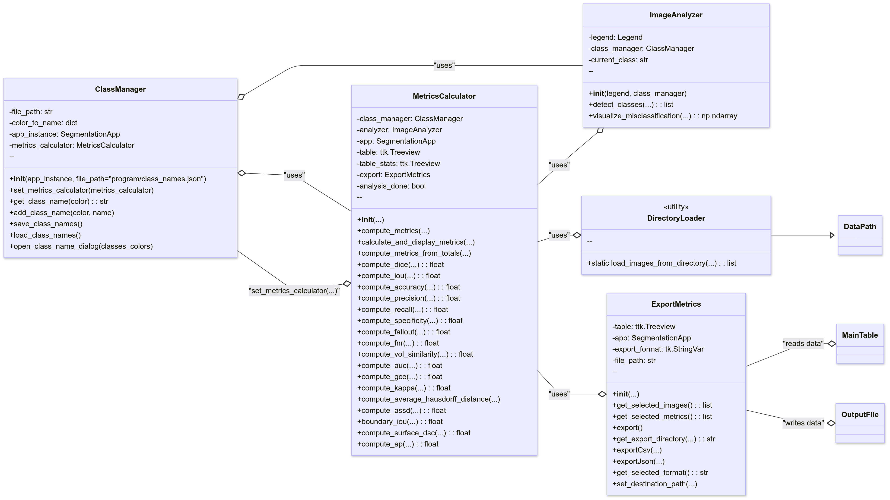
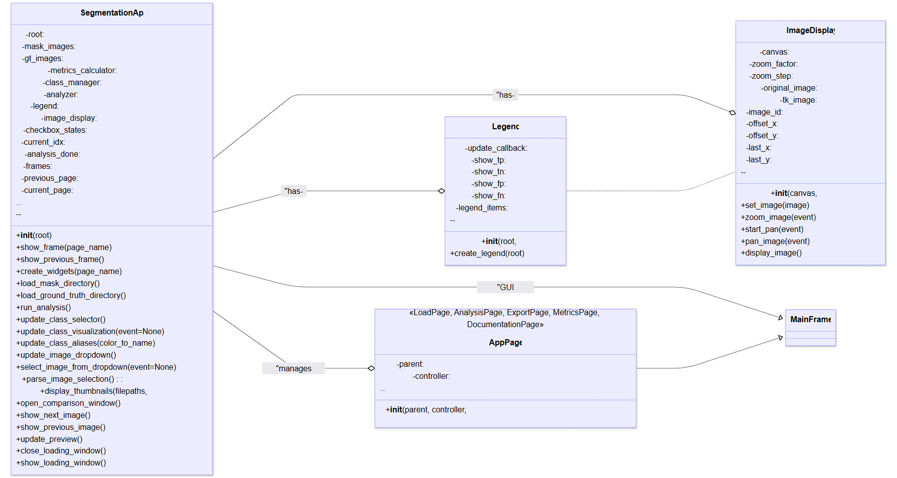

# Analysis-of-the-Results-of-Image-Data-Segmentation-Methods

# Specification of the requirements 
Thesis goal: Develop Python application that can analyze results of image segmentation using selected metrics. Application allows visualization, comparison and export of these metrics.  
Target audience: students, researchers, developers working with image segmentation models  
Requirements:
-	Input: two folders with images (ground truth and prediction)  
-	Functionalities: calculation of metrics, visualization of classification (TP, FP, TN, FN), comparison of the results, export into CSV/JSON  
-	Other: simple GUI, scalability, expandability  
Solution proposal:
Architecture: Application is split into modules:
-	Data loading (DirectoryLoader)
-	Class management (ClassManager)
-	Metric calculation (MetricsCalculator)
-	Visualization and export (ImageAnalyzer, ExportMetrics)
UML diagrams:
Function diagram – classes and their relations
  
User diagram – UI components and their logic
  
GUI design:
-	Navigation panel (LOAD -> ANALYSIS -> METRICS -> EXPORT)
-	Sections: Loading, Analysis, Metrics, Export
  
# Realization and implementation
Used technologies:
-	Python 3.12
-	OpenCV, NumPy, SciPy, Tkinter
-	Git, GitHub, Figma, TkForge
 Implementation:
-	Calculation of metrics: functions compute_<metric_name>()
-	GUI: navigation panel, interactive controls (dropdowns, checkboxes …)
-	Export: preview and format selection (CSV/JSON)

# Testing and verification of the results
Data for testing:
-	Simple synthetic segmentation dataset (ChatGPT)
Comparison with reference values:
-	Verification of metric values with existing libraries like sklearn and medpy
-	Table of compared values: majority of metrics are equivalent, some variation explained in thesis
Limits:
-	Synthetic data results don’t have to apply in all real-world scenarios
-	Some metrics don’t have publicly accessible implementation

# Installation, usage and maintenance
Installation:
-	Install supported version of Python, currently 3.12 (https://www.python.org/downloads/)
-	Run git pull https://github.com/tazman02/Analysis-of-the-Results-of-Image-Data-Segmentation-Methods  to fetch the latest version of the project
-	Install libraries from requirements.txt
(Run: pip install -r requirements.txt)
-	Run the main Python file from the project directory
(Run: python segmentation_app.py)
Usage:
-	Load ground truth and prediction datasets
-	Optional: Set class aliases for clarity in metrics
-	Run the analysis module to compute evaluation results
-	View results via the UI or console output
-	Export computed metrics to desired format (e.g., CSV, JSON)
Maintenance:
-	Pull the latest version from GitHub
(Run: git pull origin main or your current working branch)
-	To add new metrics:  Implement a new function in the metrics module,  Update the UI to include the new metric,  Submit a pull request with detailed repository comments and documentation of the changes

# Structure of repository
segmentation_app.py - main Python file, launch to start the application
testy.ipynb - some of the metrics used in compariston and testing
out.json - demo of json output
ico.png = icon used by application
class_names.json - configuration file with saved class aliases, erase whole file or specific records to delete alias
lib - folder, includes all other classes that are part of the funcionality of the application
img - folder for images, contains testing and demo data
gui - folder, contains all classes that represent gui

